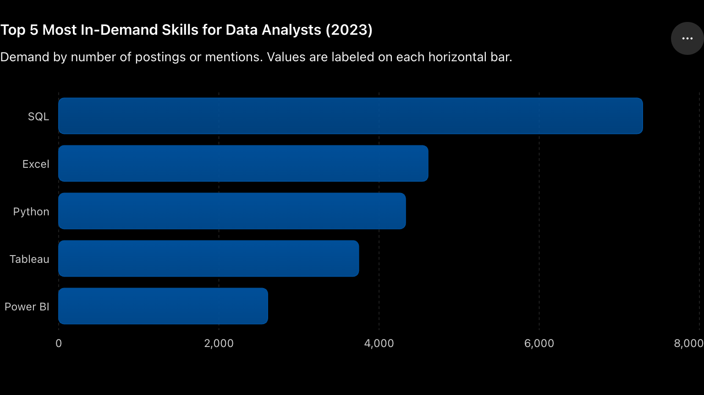
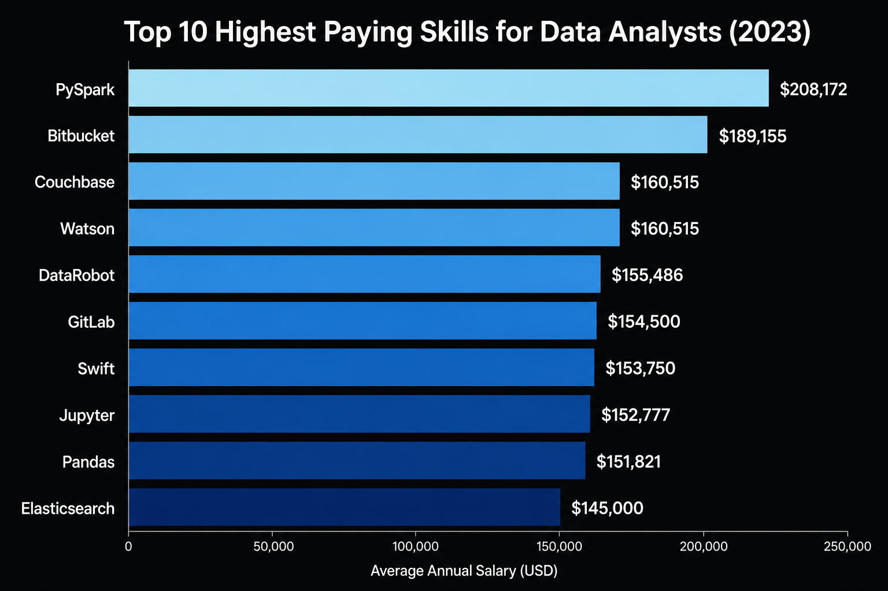

# Data Analyst Job Market Analysis

📊 Analysis of 787,000+ real 2023 job postings to identify top-paying 
Data Analyst roles, most in-demand skills, and optimal skills to learn.

SQL queries: [project_sql folder](/project_sql/)

### Questions answered:
1. What are the top-paying remote Data Analyst jobs?
2. What skills do top-paying roles require?
3. Which skills are most in demand?
4. Which skills correlate with higher salaries?
5. What are the most optimal skills to learn?

## Tools Used
- **PostgreSQL** — database management
- **VS Code** — query development
- **Git & GitHub** — version control

## Analysis

### 1. Top Paying Data Analyst Jobs

```sql
SELECT  
      job_id,
      job_title,
      job_location,
      job_schedule_type,
      salary_year_avg,
      job_posted_date,
      name AS company_name
FROM job_postings_fact
LEFT JOIN company_dim 
      ON job_postings_fact.company_id = company_dim.company_id
WHERE
      job_title_short = 'Data Analyst' AND
      job_location = 'Anywhere' AND
      salary_year_avg IS NOT NULL
ORDER BY salary_year_avg DESC
LIMIT 10;
```

**Key findings:**
- Highest paying remote Data Analyst role was $650,000 at Mantys — nearly double the next highest and likely an outlier
- Excluding the outlier, realistic top-tier range is $184,000–$336,500
- SmartAsset appeared twice in the top 10, suggesting they consistently pay above market
- Meta ($336,500) and AT&T ($255,829) were the most recognizable employers

---

### 2. Skills for Top Paying Jobs

```sql
WITH top_paying_jobs AS (
    SELECT  
      job_id,
      job_title,
      salary_year_avg,
      name AS company_name
    FROM job_postings_fact
    LEFT JOIN company_dim 
      ON job_postings_fact.company_id = company_dim.company_id
    WHERE
      job_title_short = 'Data Analyst' AND
      job_location = 'Anywhere' AND
      salary_year_avg IS NOT NULL
    ORDER BY salary_year_avg DESC
    LIMIT 10
)
SELECT 
     top_paying_jobs.*,
     skills
FROM top_paying_jobs
INNER JOIN skills_job_dim 
     ON top_paying_jobs.job_id = skills_job_dim.job_id
INNER JOIN skills_dim 
     ON skills_job_dim.skill_id = skills_dim.skill_id
ORDER BY salary_year_avg DESC;
```

**Key findings:**
- SQL appears across all top paying roles — the one non-negotiable skill
- AT&T's $255,829 role required 13 skills including PySpark, Databricks, and Azure
- The $650,000 Mantys and Meta's $336,500 roles had no skills listed — excluded by INNER JOIN
- Cloud and big data tools dominate at the highest salary tiers

---

### 3. Most In-Demand Skills

```sql
SELECT 
      skills,
      COUNT(skills_job_dim.job_id) AS demand_count
FROM job_postings_fact
INNER JOIN skills_job_dim 
      ON job_postings_fact.job_id = skills_job_dim.job_id
INNER JOIN skills_dim 
      ON skills_job_dim.skill_id = skills_dim.skill_id
WHERE
     job_title_short = 'Data Analyst' AND
     job_location = 'Anywhere' 
GROUP BY skills
ORDER BY demand_count DESC
LIMIT 5;
```

| Skills | Demand Count |
|--------|-------------|
| SQL | 7,291 |
| Excel | 4,611 |
| Python | 4,330 |
| Tableau | 3,745 |
| Power BI | 2,609 |

**Key findings:**
- SQL leads by a significant margin — 58% more demanded than Excel in second place
- Excel remains second despite being considered basic — foundational skills still dominate hiring
- Tableau beats Power BI by 30% in demand — clearer choice for visualization


*Bar chart showing demand count for top 5 Data Analyst skills*

---

### 4. Skills Based on Salary

```sql
SELECT
      skills,
      ROUND(AVG(salary_year_avg), 0) AS avg_salary
FROM job_postings_fact
INNER JOIN skills_job_dim 
      ON job_postings_fact.job_id = skills_job_dim.job_id
INNER JOIN skills_dim 
      ON skills_job_dim.skill_id = skills_dim.skill_id
WHERE
     job_title_short = 'Data Analyst' AND
     salary_year_avg IS NOT NULL AND
     job_work_from_home = true
GROUP BY skills
ORDER BY avg_salary DESC
LIMIT 25;
```

| Skills | Average Salary ($) |
|--------|-------------------|
| PySpark | 208,172 |
| Bitbucket | 189,155 |
| Couchbase | 160,515 |
| Watson | 160,515 |
| DataRobot | 155,486 |
| GitLab | 154,500 |
| Swift | 153,750 |
| Jupyter | 152,777 |
| Pandas | 151,821 |
| Elasticsearch | 145,000 |

**Key findings:**
- SQL, Excel, Python, Tableau — the 4 most in-demand skills — don't appear in top 25 highest paying. High demand does not equal high pay.
- PySpark at $208,172 is 2x Python's $101,397 — specialization within a technology pays more than knowing it generically
- DevOps tools (Bitbucket, GitLab, Jenkins) in top paying skills suggests data engineering crossover commands a premium


*Bar chart showing average salary for top 10 highest paying Data Analyst skills*

---

### 5. Most Optimal Skills to Learn

```sql
WITH skills_demand AS (
    SELECT 
           skills_dim.skill_id,
           skills_dim.skills,
           COUNT(skills_job_dim.job_id) AS demand_count
    FROM job_postings_fact
    INNER JOIN skills_job_dim 
           ON job_postings_fact.job_id = skills_job_dim.job_id
    INNER JOIN skills_dim 
           ON skills_job_dim.skill_id = skills_dim.skill_id
    WHERE
         job_title_short = 'Data Analyst' AND
         job_work_from_home = true AND
         salary_year_avg IS NOT NULL
    GROUP BY skills_dim.skill_id
), 
average_salary AS (
    SELECT
          skills_job_dim.skill_id,
          ROUND(AVG(salary_year_avg), 0) AS avg_salary
    FROM job_postings_fact
    INNER JOIN skills_job_dim 
          ON job_postings_fact.job_id = skills_job_dim.job_id
    INNER JOIN skills_dim 
          ON skills_job_dim.skill_id = skills_dim.skill_id
    WHERE
         job_title_short = 'Data Analyst' AND
         salary_year_avg IS NOT NULL AND
         job_work_from_home = true
    GROUP BY skills_job_dim.skill_id
)
SELECT
    skills_demand.skill_id,
    skills_demand.skills,
    demand_count,
    average_salary.avg_salary
FROM skills_demand
INNER JOIN average_salary 
    ON skills_demand.skill_id = average_salary.skill_id
WHERE demand_count > 10
ORDER BY avg_salary DESC, demand_count DESC
LIMIT 25;
```

| Skills | Demand Count | Average Salary ($) |
|--------|-------------|-------------------|
| Go | 27 | 115,320 |
| Confluence | 11 | 114,210 |
| Hadoop | 22 | 113,193 |
| Snowflake | 37 | 112,948 |
| Azure | 34 | 111,225 |
| BigQuery | 13 | 109,654 |
| AWS | 32 | 108,317 |
| Python | 236 | 101,397 |
| Tableau | 230 | 99,288 |

**Key findings:**
- Python (236 demand, $101,397) and Tableau (230 demand, $99,288) offer the best balance of high demand and competitive salary
- Snowflake and Azure offer higher salaries than Python with reasonable demand — logical next skills
- SQL absent from top 25 optimal skills — necessary but not sufficient for high pay

---

## What I Learned
- Multi-table JOINs connecting 3 tables simultaneously
- CTEs to break complex queries into readable components
- The gap between in-demand skills and high-paying skills is larger than expected — a finding that directly affects my own learning priorities

## Conclusions

1. **SQL is non-negotiable but not the ceiling** — highest demand but absent from top paying skills
2. **High demand ≠ high pay** — the 4 most demanded skills don't appear in top 25 highest paying
3. **Optimal entry path** — SQL + Python + Tableau covers demand and salary balance
4. **Specialization doubles pay** — PySpark ($208,172) vs Python ($101,397)
5. **Cloud skills are the next step** — Azure, Snowflake, AWS offer higher salaries with solid demand
